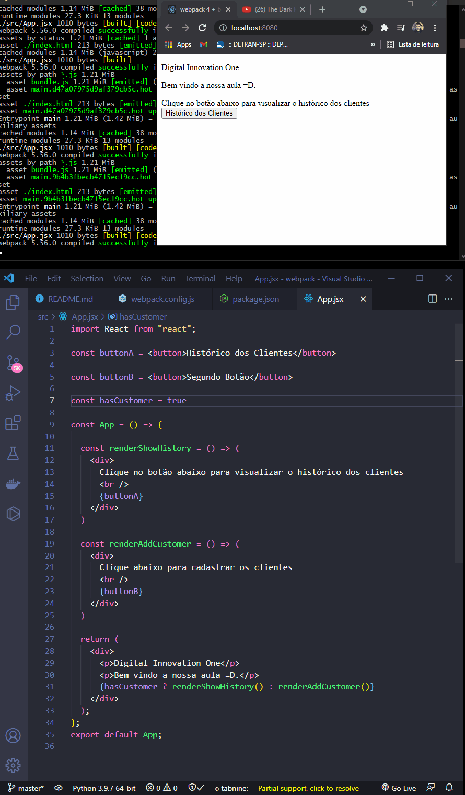

<h1 align="center">
  
   
  ReactJS - Introduction
</h1>

<h3 align="justify">
Didactic demonstration Basic State, Proprities, Create Class, Babel, WebPack, DevServer, Eslint, If-Else, Lists, Keys, Handling Events, Mock e Componentization. Credits for the Digital Innovation One React Introduction.
</h3>

 

## 📷 Demonstration

<h4 align="left"> Basic State, Proprities e Create Class </h4>
  

<h4 align="left"> WebPack </h4>
  

<h4 align="left"> EsLint </h4>
  

<h4 align="left"> If-Else </h4>
  

<h4 align="left"> If-Else Verboso</h4>
  

<h4 align="left"> If-Else Modular</h4>
  

<h4 align="left"> If-Else good habits </h4>
  

<h4 align="left"> Lists </h4>
  

<h4 align="left"> Keys </h4>
  

<h4 align="left"> Lists and Keys </h4>
  

<h4 align="left"> Handling Events 1 </h4>
  

<h4 align="left"> Handling Events 2 </h4>
  

<h4 align="left"> Mock </h4>
  

<h4 align="left"> Componentization </h4>
  

 

## 🚀 Technologies

This project was developed with the following technologies:

- ReactJS
- JavaScript ES6
- Nodejs
- HTML5

 

## ⚙ Commands
- npx create-react-app my-app
- cd my-app
- webpack.config.
- npm init
- npm i -D webpack webpack-cli
- "build": "webpack --mode production"
- npm run build
- npm i @babel/core babel-loader @babel/preset-env @babel/preset-react --save-dev
- index config
- webpack config
- .babelrc create
- npm i react react-dom
- npm i -D babel-preset-react
- app.js config
- npm i -D html-webpack-plugin html-loader
- npm run dev
- HtmlWebPackPlugin add in webpackconfig.js
- new plugins in webpackconfig.js
- npm run build
- npm i -D webpack-dev-server
- webpackconfig.js config
- npm run start
- npm install --save-dev eslint babel-eslint-plugin-react eslint-watch
- npm run eslint
- devtool: 'source-map' add in webpackconfig.js
- npm install --save-dev eslint babel-eslint eslint-plugin-react eslint-watch

## ⚙ Sources
- https://pt-br.reactjs.org/docs/create-a-new-react-app.html

 

---

Made with 💜 by Rafael Maciel
